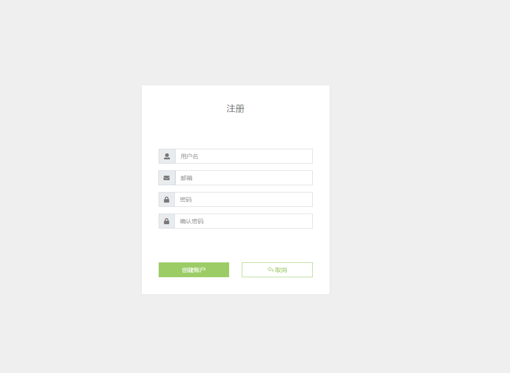
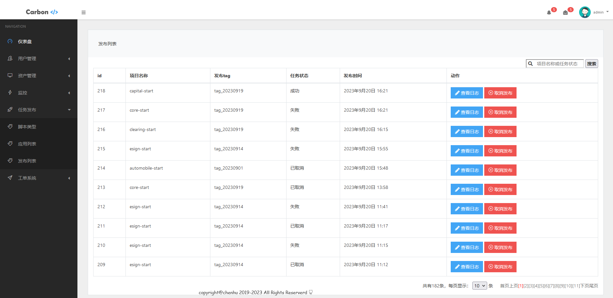

# myweb

### 一些功能截图：

### 安装方式及步骤：
一. 本地安装：

1.准备环境： 
        centos7.x 
        Python3.5+ 
        MySQL5.7+ 
        Redis3.x+

2.安装python模块

        yum install python-devel -y
        
        python3 -m venv venv
         
        source venv/bin/activate
         
        pip3 install -r requirements/require.txt
          
3.安装MySQL

        yum install mariadb-server -y && systemctl start mariadb
  
4.安装Redis

        yum install redis -y && systemctl start redis
  
5.修改settings.py中数据库及Redis配置
        
        
6.初始化数据库

	执行scripts目录下sql脚本
  
7.启动celery

        nohup celery worker -A myweb -P solo -l info &
   
8.启动server

        nohup python3 manage.py runserver 0.0.0.0:8000 &
   
9.启动成功，浏览器访问ip：8000/cmdb
	
	用户名：admin

	密码：admin

   
二. Docker安装（推荐方式）

1.启动服务

        docker-compose up -d
 
2.初始化数据库

        执行scripts目录下sql脚本

       
3.启动成功，浏览器访问ip：8000/cmdb

	用户名：admin

	密码：admin
